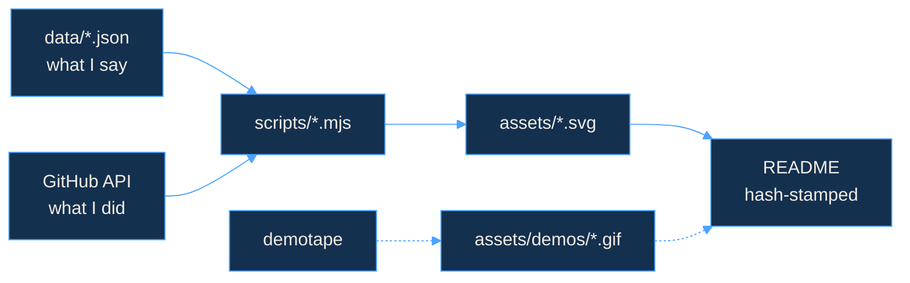

 

### `01` &nbsp;ABOUT

CS student at **BITS, Dubai**. Most of what I build starts the same way — I want something to exist, it doesn't, so I make it.

That's how I ended up with a dictation tool that types for me, a design studio for club jackets, and a thing that turns photographs into Minecraft blueprints. The through-line is design. I care about how software *feels*, not just whether it runs.

Currently deep in a cinematic portfolio and a UX certification I keep telling people about.

### `02` &nbsp;SELECTED WORK

*six things that did not exist until they annoyed me enough.*

<!-- showcase:start -->
<!-- generated by scripts/build-readme.mjs — edit data/projects.json, not this block -->
<table>
<tr>
<td width="50%" valign="top"></td>
<td width="50%" valign="top"></td>
</tr>
<tr>
<td width="50%" valign="top"></td>
<td width="50%" valign="top"></td>
</tr>
<tr>
<td width="50%" valign="top"></td>
<td width="50%" valign="top"></td>
</tr>
</table>
<!-- showcase:end -->

### `03` &nbsp;THE NUMBERS

*proof of work — regenerated twice a day by a robot I wrote. the sync stamp is real; refresh tomorrow and it will have moved.*

### `04` &nbsp;THE REEL

*a year of commits, cut into twelve frames. the gate advances, the sprockets pull, and every square is a day I either showed up or didn't.*

### `05` &nbsp;THE MACHINE

<b>director's commentary</b> — how this page builds itself

 

Nothing on this page is a badge service. Every card is an SVG this repo generates from my own data, on a schedule, and commits back to itself.

- **`scripts/palette.mjs`** — the whole look lives in one file. Change the accent there and the next refresh recolours every card on the page.
- **`build-chrome.mjs`** — the hero. The wordmark draws itself, the taglines type themselves, and the timecode in the letterbox is the real build time. The frame field genuinely advances 24 times a second, which is what the `24FPS` stamp beside it has always claimed.
- **`build-reel.mjs`** — section 04. Twelve months, twelve frames, a projector gate that steps through them.
- **`build-stats.mjs` / `build-pulse.mjs`** — telemetry from the GitHub API. The heatmap is one hue on a light-to-dark ramp; the language bar's colours were run through a colourblind-separation check rather than picked by eye.
- **`build-readme.mjs`** — regenerates the grid in section 02 and stamps each image URL with a hash of that file, so GitHub's image cache can't serve you last week's numbers.
- **`.github/workflows/demotape.yml`** — points [demotape](https://github.com/aaaditt/video-editor) at one of my own projects, records the flow, and commits the clip. Any project with a recorded clip shows it above its card automatically.

Adding a project, a tool, or a contact link is a one-line edit to `data/`. The layout solves itself.

build things that feel as good as they work &nbsp;·&nbsp; dubai 🇦🇪

